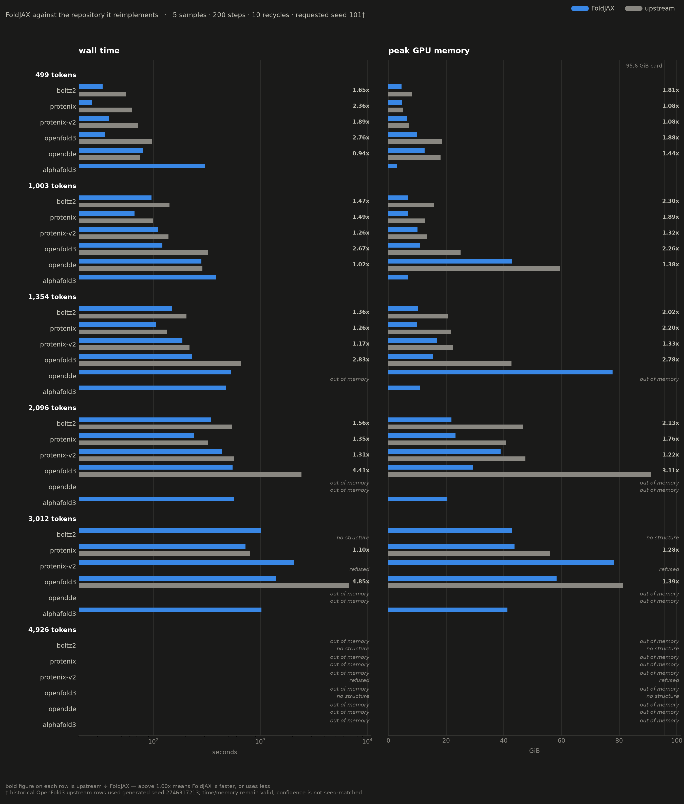

<picture>
  <source media="(prefers-color-scheme: dark)" srcset="docs/banner-dark.png">
  <source media="(prefers-color-scheme: light)" srcset="docs/banner-light.png">
  
</picture>

# FoldJAX

[](https://colab.research.google.com/github/eightmm/FoldJAX/blob/main/notebooks/FoldJAX_Colab.ipynb)

Biomolecular structure prediction in JAX. Six models behind one interface,
all carried inside the package:

| model | licence | upstream |
|---|---|---|
| `alphafold3` | Apache-2.0 code; parameters under DeepMind's own terms | [google-deepmind/alphafold3](https://github.com/google-deepmind/alphafold3) |
| `boltz2` | MIT | [jwohlwend/boltz](https://github.com/jwohlwend/boltz) |
| `esmfold2` | MIT + Biohub acceptable-use policy | [biohub/ESMFold2](https://huggingface.co/biohub/ESMFold2) |
| `opendde` | Apache-2.0 | [aurekaresearch/OpenDDE](https://huggingface.co/aurekaresearch/OpenDDE#license) |
| `openfold3` | Apache-2.0 | [OpenFold/OpenFold3](https://huggingface.co/OpenFold/OpenFold3) |
| `protenix` | Apache-2.0 | [bytedance/Protenix](https://github.com/bytedance/Protenix#license) |

Each is vendored at `foldjax.models.<name>`. The full parameter terms per
model, which are not always the code licence, are in
[docs/licences.md](docs/licences.md) — publisher summaries, not legal advice.

Boltz-2, OpenDDE, Protenix, OpenFold3 and ESMFold2 are JAX reimplementations
that match their upstream's results; AlphaFold 3 is upstream's own source,
vendored. Weights are never redistributed — each file comes from its own
publisher, under that project's terms. `foldjax setup` fetches every one that
is published, OpenFold3's exact p1 checkpoint included, and converts or stages
it. **AlphaFold 3 is the only model whose weights you have to supply
yourself**, because DeepMind releases its parameters only to applicants who
accept their terms. ESMFold2 is public but stays opt-in for its size: the full
bundle is about 26.8 GB.

Every advertised prediction path is Torch-free, including raw OpenFold3 jobs
and Protenix ESM/ISM conditioning. Publisher `.pt` checkpoints are a file
format here, not a runtime dependency: FoldJAX reads them with a restricted
NumPy archive reader. Neither the base install nor any public extra installs
PyTorch, Lightning, or TorchMetrics.

ESMFold2 is the odd one out: no evolutionary trunk, a 25 GB **ESMC-6B**
language model underneath, and *random at inference by design*, so two seeds
give genuinely different structures. Read [docs/esmfold2.md](docs/esmfold2.md)
before using it.

<picture>
  <source media="(prefers-color-scheme: dark)" srcset="docs/benchmark-dark.png">
  <source media="(prefers-color-scheme: light)" srcset="docs/benchmark-light.png">
  
</picture>

*Each port against the repository it came from — same job, same schedule, same
measurement. Numbers, method and caveats: [docs/benchmark.md](docs/benchmark.md).*

Across the twelve rows where both sides complete, FoldJAX holds a **1.08x to
2.30x** lower peak and runs at **0.94x to 4.85x** the speed. At 3,012 tokens
five of the six models finish here where two finish upstream. The caveats that
belong with those numbers — including the one row FoldJAX loses on time — are
in [docs/benchmark.md](docs/benchmark.md).

## Installation

FoldJAX requires Python 3.13. Its lockfile pins JAX 0.11.1 and the matching
cuEquivariance JAX/CUDA packages for reproducible CPU and GPU environments.

```bash
uv sync
uv run foldjax weights fetch --model boltz2      # download, verify, convert once
uv run foldjax predict --model boltz2 --input job.yaml
```

`uv sync` installs the CUDA 13 runtime and the test tools without being asked;
a CPU-only machine wants `uv sync --no-default-groups --group dev` instead, and
a CUDA 12 one is in [docs/install.md](docs/install.md).

Two models want an extra: `--extra alphafold3` (its compiled half and CCD
tables build themselves on first use) and `--extra openfold3-preprocess` (only
to featurize raw OpenFold3 jobs — predicting from a feature `.npz` needs
nothing). Mixed CUDA generations, and what each extra actually installs:
[docs/install.md](docs/install.md).

## Try it

The [Colab notebook](notebooks/FoldJAX_Colab.ipynb) runs one input through
several models from a form, detecting the accelerator and installing the
matching JAX stack itself. What it caches, how it handles checkpoints, and why
its tutorial schedule is not any model's released one:
[docs/colab.md](docs/colab.md).

The same multi-model path in Python:

```python
from pathlib import Path

from foldjax import Job, PredictionRequest, predict_batch

job_path = Job.from_sequences(
    protein=("MKTAYIAKQRQISFVKSHFSRQDILDLWIYHTQGYFPDWQNYTPGPGIRYPLTFGWCFKLVPVDPEEVVEELEKAGVE",),
    rna=("GGGAAACCC",),
    ligand_ccd=("ATP",),
    name="protein-rna-atp-demo",
).store()
report = predict_batch(
    PredictionRequest(
        models=("protenix", "opendde", "openfold3"),
        input=job_path,
        output_dir=Path("foldjax-outputs"),
        msa="none",
        on_error="continue",
    )
)
```

## Reference

The three long ones live beside the code rather than in this file, because a
README that documents every flag stops being a README.

| | |
|---|---|
| [Input](docs/input.md) | every format FoldJAX reads, what each backend accepts, and how alignments, templates and binding affinity are supplied |
| [Command line](docs/cli.md) | the complete `foldjax` surface: prediction, batches, padding, memory knobs, weights, compile cache |
| [Python API](docs/python-api.md) | requests, results, sessions, and the structured events the CLI renders |
| [Benchmark](docs/benchmark.md) | the numbers above, their method, and what each one does not say |

Per-model notes: [AlphaFold 3](docs/alphafold3.md) ·
[OpenFold3](docs/openfold3.md) · [alignments](docs/alignment.md) ·
[context parallelism](docs/context_parallel.md)

## Tests

```bash
JAX_PLATFORMS=cpu uv run pytest -q
uv run ruff check .

# One file, or one test, with no coverage gate in the way:
JAX_PLATFORMS=cpu uv run pytest -q tests/test_cache.py

# The 80% orchestration-layer gate, which only means anything on a full run.
# This is what CI enforces.
JAX_PLATFORMS=cpu uv run pytest -q \
    --cov=foldjax --cov-report=term-missing --cov-fail-under=80
```

The CPU suite and the 80% orchestration coverage gate run in CI. Each vendored
port brought its own suite to `tests/models/<name>/`. Historical publisher
parity gates may use a separately provisioned reference environment, but those
dependencies are deliberately absent from FoldJAX's package metadata. Clean
runtime tests hard-block external Torch, Lightning, TorchMetrics, and fair-esm
imports. Tests on real depositions skip without `biotite`
(`--extra openfold3-preprocess`).

## Provenance

FoldJAX vendors these ports rather than depending on them, so one install covers
data intake through model output. Each keeps its upstream module layout,
`LICENSE`, and `NOTICE`, so it stays diffable against the repository it came
from; the top-level `NOTICE` lists every upstream, its licence, and where its
port lives.

Each port's original experiment log, porting plan and gates live in
[docs/ports/](docs/ports/) — history rather than instructions, but the only
record of why each default was chosen. Model weights are covered by their own
licences and never redistributed here; AlphaFold 3's must be requested from
