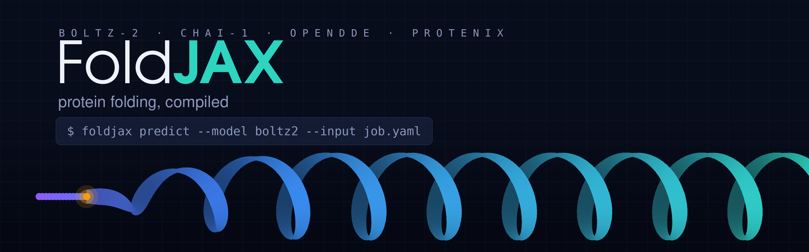

<picture>
  <source media="(prefers-color-scheme: dark)" srcset="docs/banner-dark.png">
  <source media="(prefers-color-scheme: light)" srcset="docs/banner-light.png">
  
</picture>

# FoldJAX

Biomolecular structure prediction in JAX. Five models behind one interface —
four carried complete inside the package:

| model | vendored at | licence | upstream |
|---|---|---|---|
| `boltz2` | `foldjax.models.boltz2` | MIT | [jwohlwend/boltz](https://github.com/jwohlwend/boltz) |
| `chai` | `foldjax.models.chai` | Apache-2.0 | [chaidiscovery/chai-lab](https://github.com/chaidiscovery/chai-lab) |
| `opendde` | `foldjax.models.opendde` | Apache-2.0 | [aurekaresearch/OpenDDE](https://huggingface.co/aurekaresearch/OpenDDE) |
| `protenix` | `foldjax.models.protenix` | Apache-2.0 | [bytedance/Protenix](https://github.com/bytedance/Protenix) |

— plus `alphafold3`, which FoldJAX drives rather than carries, because its
parameters may not be redistributed. It takes the same job file as the rest
once installed; see [docs/alphafold3.md](docs/alphafold3.md).

Give it one job file and a model name. Weights, the input dialect, the output
directory, and the XLA compile cache are all resolved for you.

```bash
uv sync --extra cuda13 --extra torch-bridge --group dev
uv run foldjax weights fetch --model boltz2      # download, verify, convert once
uv run foldjax predict --model boltz2 --input job.yaml
```

`torch-bridge` is only for that one conversion step: the upstream checkpoints
are torch files. **Prediction never imports torch for any model**, so once the
weights exist, `--extra cuda13` is the whole runtime.

```json
{
  "model": "boltz2",
  "output_dir": "foldjax-outputs/job",
  "samples": [
    {
      "seed": 0,
      "structure_path": "foldjax-outputs/job/boltz2_input.cif",
      "scores": {"mean_plddt": 0.9589, "iptm": 0.0}
    }
  ]
}
```

Every port keeps its own featurizer, sampler, checkpoint format, defaults, and
output writer, so results match running that project directly. FoldJAX supplies
the common request, the translation, and the plumbing.

## Input

One file, JSON or YAML, in the common schema:

```yaml
name: example
entities:
  - type: protein
    id: [A]
    sequence: ACDEFG
    unpaired_msa: msa.a3m
    modifications:
      - {ccd: SEP, position: 3}
  - {type: ligand, id: [L], ccd: ATP}
bonds:
  - [[A, 3, OG], [L, 1, PA]]
```

`--input-format` defaults to `auto` and decides on content, not extension: only
the common schema is a mapping with `entities`, and every native dialect is
passed through untouched. So a Boltz YAML, a Protenix job list, or a Chai FASTA
all work as-is.

Modifications and covalent bonds have one model-neutral spelling here and are
translated into each backend's own names — Protenix and OpenDDE want
`CCD_`-prefixed types and entity-indexed `covalent_bonds`, Boltz wants
`{ccd, position}` and a `bond` constraint, AlphaFold 3 wants bare `ptmType`.

**A field a backend cannot express is rejected, not dropped.** Neither Boltz nor
Chai has a place for a separate `paired_msa`, and Chai addresses ligands by
SMILES only. Silently discarding an MSA would change the science without
changing the exit code.

`unpaired_msa` reaches every model, Chai included. Chai's own input is a FASTA
with nowhere to put an alignment path, so FoldJAX converts the A3M into the
`.aligned.pqt` form it reads and writes that beside the FASTA. That matters more
than it sounds: otherwise a job that pins an alignment pins it everywhere except
Chai, which quietly runs on a different one — and any comparison across models
becomes a comparison of MSAs.

## Choosing what to run

```bash
uv run foldjax predict \
  --model protenix \
  --input job.yaml \
  --num-samples 5 \
  --num-steps 200 \
  --num-recycles 10 \
  --seed 42
```

`--num-samples`, `--num-steps`, and `--num-recycles` are model-neutral. Each
backend calls them something different, and FoldJAX translates:

| neutral | alphafold3 | boltz2 | chai | opendde / protenix |
|---|---|---|---|---|
| `--num-samples` | `diffusion_samples` | `diffusion_samples` | `num_diffusion_samples` | `n_sample` |
| `--num-steps` | — | `steps` | `num_diffusion_timesteps` | `n_step` |
| `--num-recycles` | `recycles` | `recycling` | `num_trunk_recycles` | `n_cycle` |
| `--max-msa-depth` | — | `max_msa_depth` | `max_msa_depth` | `max_msa_rows` |

Setting both a neutral knob and its native name is an error rather than a silent
preference, and so is asking for a knob a backend does not have — AlphaFold 3
exposes no diffusion-step count, so `--num-steps` is refused for it rather than
quietly ignored. `--option KEY=VALUE` still passes anything native straight
through.

### Memory

Peak memory on a 488-token job, one sample, at each port's own defaults:

| model | peak | warm | confidence |
|---|---|---|---|
| alphafold3 | 3,983 MiB | 14.8 s | pTM 0.66 |
| boltz2 | 4,684 MiB | 7.9 s | pLDDT 0.892 |
| protenix | 6,089 MiB | 5.5 s | pLDDT 75.05 |
| chai | 7,577 MiB | 8.6 s | pLDDT 0.849 |
| opendde | 13,433 MiB | 12.1 s | pLDDT 87.49 |

Getting there took four changes, none of which was the knob we expected. Each
came from reading XLA's buffer assignment for the peak and fixing whatever it
named — a habit worth more than any individual fix below.

**The transition was the largest buffer in three of the four ports.** It widens
its input before narrowing it again and holds three copies of the wide form at
once — `a`, `b`, and `silu(a) * b`. On OpenDDE's structural pair representation
those were three `f32[946, 946, 768]` buffers, 2,622 MiB apiece: 7,866 MiB of a
10,914 MiB arena, for an operation that reduces only over the channel axis.
Blocking the leading axis is mathematically exact, so it needs no flag: there
is no accuracy to trade, only kernel launches, and only on tensors already big
enough for that to be cheap.

**Triangle multiplication widened its projections before contracting them.**
Both are `[N, N, c_hidden]` — 1,311 MiB each on OpenDDE's structural branch —
and they were cast to float32 first, so a bfloat16 trunk still paid float32 for
its two largest tensors. They now keep their own dtype and accumulate through
`preferred_element_type`: identical float32 accumulation, half the operand
bytes. It is what AlphaFold 3's `BF16_BF16_F32` algorithm already does, and it
is most of why AF3's peak sits where it does — its released trunk runs bfloat16
weights *and* activations.

Together those two took Protenix from 12,264 to 6,089 MiB and OpenDDE from
32,185 to 13,433 MiB, with confidence flat (75.08 → 75.05 and 87.49 → 87.489).

**Eager arithmetic between compiled blocks is not free.** Chai runs its trunk
as many small programs on purpose, so XLA can release MSA intermediates between
them — but the residual `a + b` joining those programs dispatches its own
executable, with all three buffers live. On the MSA representation that is
three copies of the largest tensor in the trunk, for an add. Routing them
through a compiled add that donates its update buffer is the same arithmetic
and took Chai from 8,637 to 7,577 MiB with scores unchanged to five decimals.

**Dead outputs cost twice.** OpenDDE returned six representation tensors that
nothing reads; the structural pair representation alone was 1,311 MiB of a
1,869 MiB output, and returning it kept the refiner's working buffer live to
the end of the program. Pass `return_representations=True` to get them back.

Two things that sound like memory knobs and were not, both measured before the
fixes above: blocking the triangle *attention* moved Protenix's peak by 0.4%,
and switching its trunk to bfloat16 moved it by 0.3% — the latter because
Protenix's CLI already defaults to `--trunk-dtype bf16`, so it was measuring
nothing at all.

### `--max-msa-depth`

Every trunk holds a `[depth, tokens, channels]` MSA representation, and on a
488-token job with a 13,254-row alignment that tensor is 3,158 MiB. Capping the
depth used to halve Protenix. It no longer does — the transition fix took the
same memory without touching the alignment:

| protenix, 488 tokens | peak | pLDDT | pTM |
|---|---|---|---|
| default (13,254 rows) | 6,089 MiB | 75.05 | 0.749 |
| `--max-msa-depth 1024` | 5,989 MiB | 79.88 | 0.915 |

A 1.6% saving now, so treat it as an accuracy knob rather than a memory one.
Confidence moves with it and not monotonically, because which rows get sampled
changes; that spread is the alignment's own variance, not evidence that a
shallower MSA predicts better. The default keeps each port's own depth.

**Chai has the same knob but not the same bargain.** It embeds the selected
rows once into a `[1, depth, tokens, 64]` tensor — 2,048 MiB at its 16,384-row
bucket — and the trunk reads that, so the cap has to act at the embedding, not
at the per-recycle crop. It works, and it is the largest single lever there,
but unlike Protenix it costs accuracy rather than trading noise:

| chai, 488 tokens | peak | mean pLDDT | pTM |
|---|---|---|---|
| default | 7,577 MiB | 0.849 | 0.744 |
| `--max-msa-depth 4096` | 5,126 MiB | 0.838 | 0.735 |
| `--max-msa-depth 2048` | 4,856 MiB | 0.829 | 0.697 |
| `--max-msa-depth 1024` | **4,707 MiB** | 0.830 | 0.705 |

A third of the memory for one point of pLDDT. It stays off by default. Boltz-2
is the least sensitive of the four — 4,766 → 4,688 MiB at 1024, for 0.891 →
0.880 pLDDT — which is not worth spending, so it is off there too.

Chai's cap has two crop sites and only one of them counts: the selection in
`_embed_and_initialize` decides what gets embedded and therefore how big that
tensor is. Capping the per-recycle crop alone leaves it at full depth and moves
nothing — which is exactly what the first attempt did.

**OpenDDE is the opposite case, and it is worth knowing why.** Capping its MSA
changes nothing; blocking its attention changes everything. It is dual-branch,
and the structural refiner runs on sub-residue tokens with three times the
heads of the trunk, so its score tensor — `[946, 12, q, 946]` on a 488-residue
job — is what sizes the peak. Protenix's chunk policy maps a token count to a
chunk size and was written for that four-head trunk, so its 256 still left
10.5 GiB materialised, twice over. FoldJAX blocks that branch by bytes instead.
The budget was then swept rather than guessed:

| structural score budget | peak | warm | pLDDT |
|---|---|---|---|
| 2048 MiB | 15,639 MiB | 11.1 s | 87.4899 |
| **1024 MiB** (default) | **14,443 MiB** | 12.3 s | 87.4907 |
| 512 MiB | 14,465 MiB | 13.9 s | 87.4901 |
| 256 MiB | 14,463 MiB | 15.4 s | 87.4918 |

(Swept before the transition and triangle fixes above, which later took the
same configuration to 13,433 MiB; the shape of the curve is what matters here.)

The knee is at 1 GiB: past it the score tensor is no longer what sizes the
peak, so tightening buys nothing and costs 13% wall time per halving.
Confidence is flat across the whole sweep, because blocking the query axis is
exact — the softmax still reduces over the entire key axis inside each block.
Before any of this, OpenDDE asked for 76 GiB and died.

OpenDDE is still the heaviest of the five, and some of that is the model rather
than the implementation: its structural refiner runs on 946 sub-residue tokens
for a 488-residue job, with a 384-channel pair representation. That tensor is
1,311 MiB in float32 where AlphaFold 3's `[488, 488, 128]` bfloat16 pair is
61 MiB, and the refiner keeps several of them live at once. `--trunk-dtype
bf16` halves the element width for 12,563 MiB at a cost of 0.098 pLDDT; it is
off by default because that cost is real, small as it is.

The same lesson every time, and never in the same direction twice: **attribute
the peak, then turn the knob it points at.** Capping the MSA halved Protenix
and did nothing for OpenDDE; blocking the attention halved OpenDDE and did
nothing for Protenix; and blocking the transition then halved Protenix again,
which made the MSA cap it had started with almost irrelevant. Every one of
those was read out of XLA's buffer assignment. None was guessable from the
model description, and two of our confident predictions were wrong.

`foldjax plan` shows exactly what a request resolves to before anything loads:

```console
$ uv run foldjax plan --model protenix --input job.yaml --num-samples 2
{
  "cache_dir": "/home/you/.cache/foldjax/compile",
  "input_format": "foldjax",
  "model": "protenix",
  "output_dir": "foldjax-outputs/job",
  "sampling": {"num_samples": 2},
  "weights": "/home/you/.cache/foldjax/weights/protenix/protenix_base_default_v1.0.0.jax"
}
```

## Weights

Every upstream project publishes torch checkpoints; FoldJAX predicts from
torch-free JAX weights. `foldjax weights` owns that gap — it downloads from each
publisher, verifies against the published hash where one exists, converts once,
and stores the result under the FoldJAX home.

```bash
uv run foldjax weights list                     # what is downloaded and converted
uv run foldjax weights fetch --model opendde    # download, verify, convert
uv run foldjax weights path --model opendde     # where it landed
uv run foldjax home                             # every location FoldJAX uses
```

```
~/.cache/foldjax/          # or $FOLDJAX_HOME, or $XDG_CACHE_HOME/foldjax
├── downloads/<model>/     # released files, exactly as published
├── assets/                # CCD dictionaries shared by protenix and opendde
├── weights/<model>/       # converted JAX weights — what prediction loads
└── compile/               # XLA persistent compilation cache
```

Conversion needs torch, which is why it is a separate step behind
`--extra torch-bridge`. Prediction never imports it.

No weights are redistributed. Each file is downloaded from its own publisher
under that project's terms, and nothing is fetched implicitly during prediction —
a missing model names the command that would get it.

Chai's conformer archive is an `antipickle` file; upstream reads it by
importing `chai_lab` for its private adapters, which needs torch and pins an
rdkit this environment cannot hold. FoldJAX decodes the format directly
instead, so `--model chai` is one command like the rest.

Weight files exported before these ports were vendored recorded
`protenix_jax.*` / `opendde_jax.*` as their module names. The loader maps those
onto the vendored classes, so **existing weight files keep working**, and the
restricted unpickler still rejects arbitrary globals.

## GPU and the compile cache

These graphs take minutes to compile and seconds to replay, so the persistent
XLA cache is on by default and namespaced per model, weight identity, runtime
profile, and the options that actually change the compiled program. Different
models and weight sets never share a cache entry, and options that only affect
output formatting never fragment one.

Measured on an RTX PRO 6000 Blackwell Max-Q, same 35-residue job, one sample,
20 diffusion steps, one recycle. Upstream is each model's own repository on
torch, given the same input and settings.

This table predates the memory work above and has not been re-run against
upstream since; the FoldJAX peak column is now lower than it shows. Read it for
the wall-clock and program-count comparison, and the 488-token table at the top
of [Memory](#memory) for current peaks.

| model | FoldJAX | of which model | upstream | FoldJAX peak | upstream peak | programs |
|---|---|---|---|---|---|---|
| `boltz2` | **10.4 s** | 4.4 s | 19.7 s | **2183 MiB** | 2019 MiB | 140 |
| `opendde` | 13.0 s | **1.8 s** | 9.1 s | **2731 MiB** | 5915 MiB* | 238 |
| `chai` | 20.4 s | 5.2 s | 28.4 s | **1646 MiB** | 8065 MiB* | 523 |
| `protenix` | **12.1 s** | 3.0 s | 49.4 s | **1832 MiB** | 3663 MiB* | 159 |

**Read the memory column carefully, and do not read it off `nvidia-smi`.** That
tool reports what the CUDA allocator has *reserved*, not what the program is
using, and XLA's BFC allocator grows by doubling: three of these models parked
on exactly 4094 MiB of reserved pool no matter whether they needed 1.6 GB or
4.0 GB of it. The column above is `peak_bytes_in_use` from
`jax.local_devices()[0].memory_stats()`, which is the real high-water mark;
`nvidia-smi` sits 0.9-2.6 GB above it. The upstream column is
`torch.cuda.max_memory_allocated()`, the same quantity. Starred entries are
still `nvidia-smi` peaks, so they flatter FoldJAX by whatever torch's caching
allocator over-reserved; `boltz2` is the one measured both ways on both sides.

Two things made the difference. **Layer weights were being copied inside the
traced graph**: every port stacks its per-layer parameters onto one axis so
`lax.scan` can walk them, and doing that with `jnp.stack` inside `jit` makes
XLA emit a `concatenate` over the weights -- 2,290 MiB of them in Boltz-2's
optimized HLO, for a 35-residue job. Stacking on the host at load time instead
(`foldjax.models._stacking`) cut the temp arena from 845 to 118 MiB for
`boltz2` and from 1,438 to 88 MiB for `opendde`, and left the numbers
unchanged. **And the eager ports were dispatching the model op by op**: OpenDDE
once ran 1,824 programs per prediction, Protenix 666. Tracing each whole graph
once -- `opendde_infer_compiled`, `protenix_infer_compiled` -- collapsed those
to 238 and 159. For Protenix that is 30.9 s down to 12.1 s, with the predicted
structure identical to the op-by-op path within its own run-to-run noise
(0.0753 A RMSD against a 0.0738 A floor between two identical eager runs).
`--no-graph-jit` restores the op-by-op path on either model.

The "of which model" column is the second prediction in the same process, so it
excludes weight loading, featurization, and reading the compiled program back
from the cache. Those one-off costs dominate a single short job -- OpenDDE
spends 1.8 s in the model and about 12 s getting ready to -- which is worth
knowing before optimizing the wrong thing. Chai has the most room left: 523
programs and the slowest steady state of the four.

Confidence agrees with upstream where the sampler is converged enough to
compare — OpenDDE pLDDT 92.75 vs 93.16, pTM 0.819 vs 0.828, gPDE 0.354 vs 0.357;
Chai's aggregate score 0.16815 vs 0.1681. These are still *different samples*:
torch and JAX PRNG streams differ, so the diffusion noise differs, and at a
20-step schedule that moves the numbers. Same-seed numerical parity was
established separately per port with a matched random tape.

Two caveats on the upstream side: Protenix's fused CUDA layer-norm needs
`ninja` to JIT-compile, so it ran with `LAYERNORM_TYPE=torch`; and OpenDDE pins
`torch==2.7.1+cu126`, which has no kernels for this GPU and fails with "no
kernel image is available" while its runner still reports success, so it was
upgraded to `torch==2.12.0+cu130` to run at all.

`--no-cache` turns it off for benchmark or ephemeral runs; `--cache-dir` moves
the root. Every model also runs on CPU, slowly.

## Python API

```python
from foldjax import PredictionRequest, predict

result = predict(
    PredictionRequest(
        model="chai",
        input="job.yaml",
        num_samples=5,
        seed=42,
    )
)
for sample in result.samples:
    print(sample.structure_path, sample.scores)
```

`foldjax.resolve_request` applies every default without running anything, and
`foldjax.capabilities(model)` reports the input formats, entity types, and
sampling knobs a backend honours. Backend-specific output stays on
`PredictionResult.raw`.

## Environment

One Python 3.12 environment, no sibling checkouts:

- JAX / CUDA 13 plugin 0.10.1, cuequivariance-jax 0.10.0 with CUDA 13 ops 0.9.0,
  Tokamax 0.0.12

```bash
uv sync --extra cuda13 --group dev                       # predict with any model
uv sync --extra cuda13 --extra torch-bridge --group dev  # + convert checkpoints
```

**The prediction environment is torch-free for every model.** Boltz-2's
featurizer is vendored from upstream Boltz and written against torch; it runs
here on a NumPy array layer (`foldjax.models.boltz2.data._numpy_torch`) that
reproduces the torch featurizer exactly. `--extra boltz-preprocess` installs
real torch so the two can be compared, which is what
`tests/models/boltz2/test_featurize_torch_parity.py` does.

Two further backends stay external because they cannot be vendored.

**AlphaFold 3** is fully wired and runs from the same job file as the other
four — `foldjax predict --model alphafold3 --input job.yaml` — but FoldJAX
drives an installation you provide rather than carrying one. Its parameters are
not redistributable, and upstream pins `jax[cuda12]`, which cannot co-resolve
with a CUDA 13 cluster; the right JAX plugin differs per site. It is therefore
deliberately absent from the dependency set.
[docs/alphafold3.md](docs/alphafold3.md) has the install for either CUDA
generation, where the weights go, and what changes on a device whose shared
memory the upstream Triton kernels do not fit.

**`openfold3-jax`** is an in-progress sibling port, registered and enabled by
`--extra openfold3`.

## Tests

```bash
JAX_PLATFORMS=cpu uv run --extra cuda13 --group dev pytest -q
uv run --extra cuda13 --group dev ruff check .
```

1,020 tests pass with the optional extras installed, 85% coverage on the
orchestration layer. Each vendored port brought its own suite to
`tests/models/<name>/`, including the torch-parity gates it was built against.
Those are excluded from collection unless the extra they need is installed — so
the torch-free environment runs the subset that does not need one — and
`tests/models/test_optional_suite_gate.py` keeps that exclusion list honest
rather than letting a suite go quietly uncollected.

## Provenance

FoldJAX vendors these ports rather than depending on them, so one install covers
data intake through model output. Each keeps its upstream module layout,
`LICENSE`, and `NOTICE`, so it stays diffable against the repository it came
from; the top-level `NOTICE` lists every upstream, its licence, and where its
port lives.

Model weights are covered by their own licences and are never redistributed
here. AlphaFold 3 goes further — its parameters may not be redistributed at
all, so it is the one backend FoldJAX drives rather than carries. See
[docs/alphafold3.md](docs/alphafold3.md).
