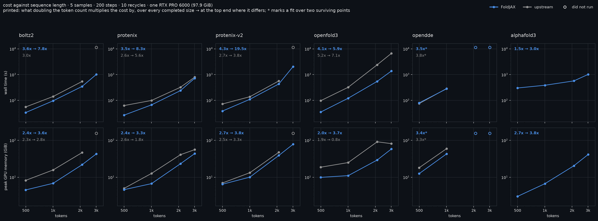
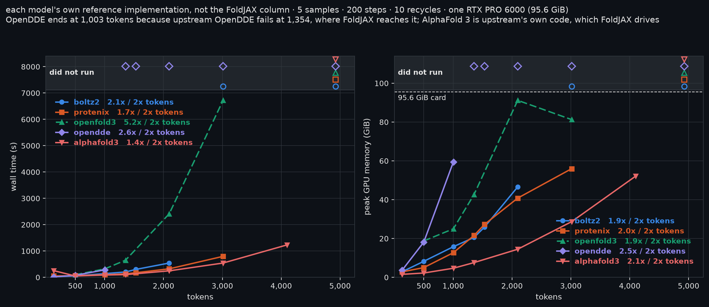
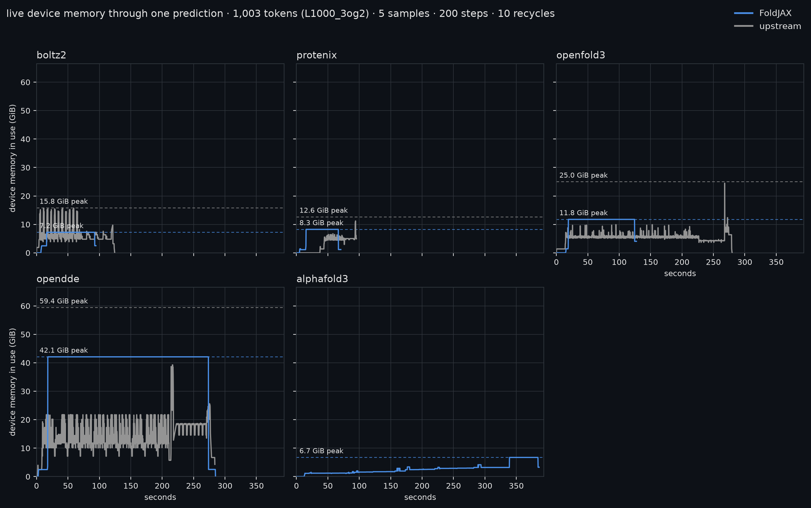

# FoldJAX against upstream

Every FoldJAX-side runtime here is JAX. Five models are reimplementations of published
torch models; AlphaFold 3 is the official JAX distribution driven through the
same FoldJAX interface. The useful comparison is against each model's own
reference repository, on the same job, under the same nominal schedule, measured the
same way.

That is what [`bench/`](../bench/) does. The current harness reruns one row per
process and records byte identities for its external inputs and checkpoints,
plus upstream source/runtime identity where applicable. The checked-in table
rows predate that result schema, so they are dated measurement evidence rather
than exact source-and-artifact replay capsules. The additional historical
dirty-worktree limitation for the optimization rows is recorded below.

<picture>
  <source media="(prefers-color-scheme: dark)" srcset="benchmark-dark.png">
  <source media="(prefers-color-scheme: light)" srcset="benchmark-light.png">
  
</picture>

**The schedule is AlphaFold 3's released default — 5 diffusion samples, 200
diffusion steps, 10 recycles, seed 101 — not a number chosen here.** Protenix's
base model ships the same three. Boltz-2 defaults to 3 recycles rather than 10,
so this asks more of it than its own default does; it asks the same of its
upstream, which is what makes the comparison mean anything.

All rows were measured on one NVIDIA RTX PRO 6000 Blackwell Max-Q workstation
GPU (`sm_120`, 300 W cap). `nvidia-smi` reports 97,887 MiB (95.6 GiB) of total
memory; PyTorch reports 94.97 GiB usable, so capacity statements below name the
measurement they use rather than treating those values as interchangeable.

One historical exception was discovered during the 2026-08-31 harness audit.
The recorded upstream OpenFold3 rows passed 0.3.1's `--num_model_seeds 1`; that
flag overrides the YAML list and generated its sole seed from 42
(`2746317213`) instead of using 101. Their shapes, schedule, time, and memory
remain valid, but their confidence values are not seed-matched to FoldJAX. The
harness now omits that flag and takes `[101]` from `openfold3_runner.yml`; the
upstream OpenFold3 confidence cells below carry a dagger until re-measured.
Those historical upstream rows also left `--use_templates=true` despite having
no template input, so their wall times include avoidable template/CCD
initialization. Current runs pass `--use_templates false`; the old timings stay
labelled historical rather than being rewritten. The retained 3,012-token cell
also disables the preset's confidence-head host offload, a measured harness
variant that changed 6,782 s/81.0 GiB to 6,722 s/83.2 GiB.

| tokens | model | FoldJAX s | upstream s | FoldJAX GiB | upstream GiB | speed | memory | confidence | FoldJAX | upstream |
|---|---|---|---|---|---|---|---|---|---|---|
| 499 | alphafold3 | 302 | - | 3.0 | - | - | - | - | - | - |
| 499 | boltz2 | 34 | 55 | 4.5 | 8.2 | 1.65x | 1.81x | complex_plddt | 0.9704 | 0.9700 |
| 499 | esmfold2 | 31 | - | 16.1 | - | - | - | - | - | - |
| 499 | opendde | 80 | 75 | 12.5 | 18.1 | 0.94x | 1.44x | ranking_score | 0.1946 | 0.1947 |
| 499 | openfold3 | 35 | 97 | 9.9 | 18.7 | 2.76x | 1.88x | ptm† | 0.9325 | 0.9274 |
| 499 | protenix | 27 | 63 | 4.6 | 5.0 | 2.36x | 1.08x | ranking_score | 0.1937 | 0.1935 |
| 499 | protenix-v2 | 38 | 72 | 6.5 | 7.0 | 1.89x | 1.08x | ranking_score | 0.1950 | 0.1947 |
| 1003 | alphafold3 | 386 | - | 6.7 | - | - | - | - | - | - |
| 1003 | boltz2 | 96 | 141 | 6.9 | 15.8 | 1.47x | 2.30x | complex_plddt | 0.9495 | 0.9482 |
| 1003 | esmfold2 | 69 | - | 23.1 | - | - | - | - | - | - |
| 1003 | opendde | 281 | 287 | 42.9 | 59.5 | 1.02x | 1.38x | ranking_score | 0.1926 | 0.1930 |
| 1003 | openfold3 | 121 | 323 | 11.1 | 25.0 | 2.67x | 2.26x | ptm† | 0.9307 | 0.9300 |
| 1003 | protenix | 67 | 99 | 6.7 | 12.7 | 1.49x | 1.89x | ranking_score | 0.1921 | 0.1922 |
| 1003 | protenix-v2 | 110 | 138 | 10.1 | 13.3 | 1.26x | 1.32x | ranking_score | 0.1931 | 0.1927 |
| 1354 | alphafold3 | 478 | - | 11.0 | - | - | - | - | - | - |
| 1354 | boltz2 | 150 | 204 | 10.2 | 20.6 | 1.36x | 2.02x | complex_plddt | 0.8275 | 0.8305 |
| 1354 | opendde | 529 | failed | 77.8 | failed | - | - | - | - | - |
| 1354 | openfold3 | 230 | 652 | 15.4 | 42.7 | 2.83x | 2.78x | ptm† | 0.8264 | 0.8360 |
| 1354 | protenix | 106 | 133 | 9.8 | 21.6 | 1.26x | 2.20x | ranking_score | 0.1800 | 0.1799 |
| 1354 | protenix-v2 | 186 | 217 | 16.9 | 22.5 | 1.17x | 1.33x | ranking_score | 0.1810 | 0.1811 |
| 2096 | alphafold3 | 571 | - | 20.5 | - | - | - | - | - | - |
| 2096 | boltz2 | 347 | 543 | 21.9 | 46.6 | 1.56x | 2.13x | complex_plddt | 0.9799 | 0.9795 |
| 2096 | opendde | failed | failed | failed | failed | - | - | - | - | - |
| 2096 | openfold3 | 547 | 2,411 | 29.3 | 91.2 | 4.41x | 3.11x | ptm† | 0.9058 | 0.9175 |
| 2096 | protenix | 240 | 323 | 23.2 | 40.8 | 1.35x | 1.76x | ranking_score | 0.9602 | 0.9604 |
| 2096 | protenix-v2 | 434 | 569 | 39.0 | 47.5 | 1.31x | 1.22x | ranking_score | 0.9645 | 0.9652 |
| 3012 | alphafold3 | 1,019 | - | 41.3 | - | - | - | - | - | - |
| 3012 | boltz2 | 1,016 | failed | 43.0 | failed | - | - | - | - | - |
| 3012 | opendde | failed | failed | failed | failed | - | - | - | - | - |
| 3012 | openfold3 | 1,385 | 6,722 | 58.4 | 81.3 | 4.85x | 1.39x | ptm† | 0.8711 | 0.8748 |
| 3012 | protenix | 723 | 797 | 43.7 | 56.0 | 1.10x | 1.28x | ranking_score | 0.9554 | 0.9502 |
| 3012 | protenix-v2 | 2,054 | failed | 78.2 | failed | - | - | - | - | - |
| 4926 | alphafold3 | failed | - | failed | - | - | - | - | - | - |
| 4926 | boltz2 | failed | failed | failed | failed | - | - | - | - | - |
| 4926 | opendde | failed | failed | failed | failed | - | - | - | - | - |
| 4926 | openfold3 | failed | failed | failed | failed | - | - | - | - | - |
| 4926 | protenix | failed | failed | failed | failed | - | - | - | - | - |
| 4926 | protenix-v2 | failed | failed | failed | failed | - | - | - | - | - |

**1,354 tokens is where FoldJAX runs a size its upstream cannot.** OpenDDE
finishes in 529 s at 77.8 GiB. Upstream OpenDDE holds 91.15 GiB, asks for
another 9.82, and dies on a 94.97 GiB card -- then writes that to an `ERR/`
file and exits 0, which is why the row reads `failed` rather than a
twelve-second run that beat everything else. The size was chosen rather than
guessed: at 1,003 tokens upstream peaks at 59.5 GiB against FoldJAX's 42.9, and
carrying both forward puts upstream's ceiling near 1,270 tokens and FoldJAX's
near 1,520. The window is about 250 tokens wide, and 1,531 is already outside
it on both sides. OpenFold3 is 2.83x faster and uses 2.78x less memory at this
size; its time advantage later widens, while its memory ratio peaks at 3.11x at
2,096 tokens and narrows at 3,012.

**OpenDDE has a lever this table cannot use.** It is the first model to fail
here, and its `dtype=bfloat16` option runs sizes its fp32 default cannot: at
1,531 tokens fp32 asks for 86.7 GiB and dies, where bf16 finishes in 443 s at
44.2 GiB. At 1,354 tokens, where both run, bf16 takes 335 s and 34.7 GiB
against fp32's 529 s and 77.8 GiB -- 1.58x the speed on 2.24x less memory. The
structures agree: across the two precisions the median TM-score is 0.964,
against 0.962 within each precision's own five samples, so they differ no more
than this model's diffusion sampling already does.

**FoldJAX ships that lever on by default since 2026-08-28**; upstream still
ships fp32. The table's OpenDDE row therefore pins `dtype=float32` on the
FoldJAX side -- `bench/spec.py`'s `COMPARISON_OPTIONS` -- because a comparison
run at two different precisions is not a comparison, and a default is exactly
the thing nobody remembers to pass. So these columns keep measuring the same
program upstream runs, and the numbers above are what a default `foldjax
predict --model opendde` now does instead.

**2,096 tokens is the last size most of these upstreams reach.** Upstream
Boltz-2 and upstream Protenix v2 both complete here and neither survives 3,012
-- one runs out of memory, the other refuses by assertion. OpenDDE is already
gone on both sides, which puts its wall between 1,003 and 2,096 rather than
anywhere near the top of the table. OpenFold3's memory margin is widest here at
3.11x while its time margin widens from 4.41x here to 4.85x at 3,012 tokens;
the 91.2 GiB upstream peak is 95.4% of the 95.6 GiB `nvidia-smi` total. That its
peak then *falls* at 3,012 is the chunk-size search described under
[How the cost grows](#how-the-cost-grows), not a measurement error.

**ESMFold2 has two rows and no upstream column.** No torch ESMFold2
environment is provisioned on this host, so there is nothing to compare against
-- the same reason AlphaFold 3's column is blank, arrived at differently. It
runs the same schedule as every other row. It stops at 1,003 tokens because its
peak is one `num_samples * L^2 * 4*c_z` arena and the larger sizes were not
attempted, and it is absent from the figure for that reason: two of six sizes
is a gap in a panel, not a series. Its rows are here rather than dropped,
because a reader cannot otherwise tell "not measured" from "left out".

**`protenix-v2` is a second checkpoint, not a sixth port.** Protenix ships two
supported models and FoldJAX runs both through the same code: v2 is the same
blocks at c_z=256 with `hidden_scale_up`, 464M parameters against the release's
368M. A benchmark row is a (weights, schedule) pair, so it gets its own rows,
and both sides run the same schedule on the same job as everything else here.
Its checkpoint was measured on 2026-08-25.

**Re-measured 2026-08-28 at `4dbad2b`**, FoldJAX side only, after a day that
added 35 commits bounding caches, streaming parses and releasing host state:
2,096 and 3,012 tokens came back **identical to a tenth of a GiB on every
model**, and 4,926 still fails on all six. Wall clock moved -8 s to +22 s,
inside what this card's clock does between runs.

**The gap between 3,012 and 4,926 has since been filled, and the ceiling is in
it.** A 4,100-token point (`L4000_1gte`) was measured on 2026-09-01: AlphaFold 3
completes it at 52.1 GiB, Protenix at 75.3 and Boltz-2 at 76.4, while OpenFold3
asks for a single 107.85 GiB block and OpenDDE for 88.75. The two survivors sit
at 88-89% of the pool, and their own memory exponents put the wall at roughly
4,350-4,400 tokens -- so 4,926 failing on all six is a size past the hardware
rather than a property of the ports. What that costs in time, why the exponent
jumps there, and the two levers that turn out not to move it are in
[Where this card's ceiling actually is](engineering-notes.md#where-this-cards-ceiling-actually-is-and-what-does-not-move-it).

That is the expected result rather than a null one. Those commits are
loader-stage and host-side by their own description; the peak here is an XLA
arena, which is deterministic for a fixed program and shape. A GPU peak that
moved would have meant one of them changed the compiled program.

**Its 3,012-token row is the one place the two implementations disagree about
what is possible.** Upstream refuses protenix-v2 above 2,560 tokens by
assertion, before allocating anything, and its own message gives the reason:
"It might cause OOM." That is a memory budget rather than an architectural
bound — the relative position encoding buckets residue separation with
`clip(delta, 0, 2 * r_max)` at r_max=32, so nothing in the model is bounded by
token count — and a budget calibrated on one implementation does not transfer
to another that uses 1.2x to 1.3x less. FoldJAX warns with the expected size
and runs: 3,012 tokens completed five samples at 78.2 GiB. `strict_token_limit`
restores upstream's refusal for a caller who wants it. Neither implementation
validates the model at that length, which the warning says too.

**Every attempted 4,926-token cell failed.** The row is in the table because a
size nothing reaches is a result, but the failures are not the same. Five
FoldJAX routes ask for more than the 95.6 GiB `nvidia-smi` total holds, so no
allocator setting reaches them. Base Protenix is the one that does not: it
needed 90.5 GiB, inside the device, and still failed with the pool raised to
0.98, which makes its wall fragmentation rather than total size. Upstream
Protenix v2 never allocates at all -- it refuses above 2,560
tokens by assertion, the same refusal as at 3,012. Upstream Boltz-2 reaches
92.2 GiB, produces nothing, exits 0, and writes no reason anywhere; that row is
`failed` on the absence of a structure, which is the only thing it is honest to
say.

The sizes those runs report at the moment they fail are not peaks, and ranking
them would be a mistake. A run dies at the first allocation that does not fit,
so an implementation that dies early reports a *smaller* number than one that
gets further: OpenDDE reports 127.1 GiB, the second largest here, while its own
measured growth puts what it would actually have needed at this size near a
thousand.

**AlphaFold 3's own repository says 5,120 tokens fit on an 80 GB card, and
this one does not get there.** Upstream's `docs/performance.md` puts a
5,120-token fold at 2,547 s on an A100 80 GB and 1,416 s on an H100 80 GB, with
`XLA_PYTHON_CLIENT_PREALLOCATE=true` and `XLA_CLIENT_MEM_FRACTION=0.95`;
unified memory is what it recommends *above* that size, not for it. Here the
same model asks for 102.8 GiB at 4,888 tokens, past the 95.6 GiB
`nvidia-smi` total. What
could reasonably differ was checked and does not: the vendored
`pair_transition_shard_spec` is upstream's 80 GB profile, flash attention is
`triton` on both sides, the input is padded to the same 5,120-token bucket, and
the schedule is AlphaFold 3's released default. The input is not it either --
a six-chain 4,926-token assembly needs 104.5 GiB and a single-chain 4,888-token
protein 102.8, and that single chain carries an 11,320-row alignment against
the assembly's 377, so depth is not driving it. Nor is the allocator: raising
the pool to upstream's 0.95 changes nothing, because the request is past the
device rather than past the pool, and preallocation is already on here -- with
nothing set, one tiny array takes 73,573 MiB of 97,887, which is JAX's own
0.75. The gap is real and unexplained. What is ruled out is written down so the
next attempt does not begin by ruling it out again.

This row's alignment is also shallower than the rest of the table's -- 377 rows
against 2,658 at 1,354 tokens -- because the target is a bacterial toxin with
few homologues. Both columns read the same file, so the comparison between them
is unaffected; the growth curve is, and this size sits below the trend the
other five set.

**Protenix's rows are one seed's draw of the alignment.** Its trunk samples a
random number of MSA rows per recycle, so the compiled program's MSA tensor is
sized by the largest draw across the ten -- 94.5% of the cap at seed 101, and
anywhere from 51.6% to 100% across seeds. That is upstream's own sampler, not a
port choice, but it means a Protenix peak re-measured at another seed moves for
a reason unrelated to the code. See
[Protenix's peak moves with the seed](engineering-notes.md#protenixs-peak-moves-with-the-seed-through-the-alignment).

**This table is a dated measurement ledger, not a live benchmark of HEAD.** The
core 499-, 1,003-, 2,096-, and 3,012-token FoldJAX sweep was re-measured on
2026-08-24 at `0c2d70b`; Protenix v2, ESMFold2, and the 1,354- and 4,926-token
rows were added over the following two days. The 2,096-, 3,012-, and
4,926-token FoldJAX rows were then checked again at `4dbad2b`, as recorded
above. Route changes have landed since: OpenDDE's bfloat16 trunk default, its
in-loop confidence scoring, OpenFold3's bounded confidence pass, AlphaFold 3's
released-width sample sharding, and the Tokamax persistence above. Each was
measured as its own A/B rather than by re-running this table, and those records
are linked from the sections below and from the README. The upstream columns
are the unchanged runs already on record.
Re-running them is not free — OpenFold3's 3,012-token row alone is 6,722 s — so
new FoldJAX measurements are compared with that pinned reference rather than
silently relabelling every old cell as current. The 2026-08-24 measurement was
taken in a private worktree with its own virtualenv, because the first attempt
shared a checkout with other work and lost its CUDA jaxlib to a concurrent
`uv sync` halfway through; JAX prints one line and continues on the CPU, so the
runs after that point failed in ways that said nothing about the models.
The committed Markdown table and rendered figures also predate the current
result schema and its job/A3M/native-input/checkpoint byte fingerprints. The
merged raw JSON archive used to render them remains in the measurement
worktree, not this checkout; `bench/results/` contains only the earlier rows
pooled into the upstream scaling figure. Their named revisions and disclosed
environments bound the evidence available, but a clean clone cannot regenerate
this historical table or its figures exactly. New harness rows carry the
stronger provenance described above.

Method: **same job** (the upstream input is generated by FoldJAX's own
translator, both sides name the same alignment), **same measurement**
(live-bytes high-water mark on both sides, never `nvidia-smi`'s reserved
pool), **FoldJAX timed warm** (the discarded first run populates eligible cache
entries; the measured process includes any rejected entry and recompilation),
and **the same confidence field on both sides** — different samples, since the
PRNG streams
differ. The historical OpenFold3 upstream rows also used the different
effective seed disclosed above; their confidence cells are not seed-matched
parity points. Matched-tape parity is a separate, per-port exercise.

Two cautions about reading a column rather than a cell. `ranking_score` is
`0.8*ipTM + 0.2*pTM`, and Protenix and OpenDDE report `ipTM = 0` for a single
chain, so on the 499- and 1,003-token targets that column is one fifth of pTM
and hides four fifths of any change; at 2,096 and 3,012 tokens, which are
four-chain, it is the complex score and jumps to ~0.95. AlphaFold 3 omits
`ipTM` for a monomer and ranks on pTM instead, so its own ranking score on the
499-token target is 0.967 where Protenix's is 0.194 — the same kind of target,
scored on two different definitions. It does not appear in this table's
confidence column, which shows only fields both sides reported. And on
timing, this card is power-limited: through these runs it sat at its 300 W cap
with a median SM clock of 1,567 MHz against 2,272 MHz unloaded, so the long
rows are throttled numbers. Both sides of every ratio ran under the same
conditions, but the absolute seconds are not what an unthrottled card would
give.

**Every upstream runs on the fastest path this hardware lets it reach.**
[`bench/upstream-environments.md`](../bench/upstream-environments.md) records each
virtualenv's provisioning, the kernels that cannot run on this card, and how to
verify both.

## `num_samples` sweep

Measured 2026-08-29 at `1ed2b71` on `t0128` (132 tokens), with seed 101, 200
diffusion steps, and 10 recycles. This is one common comparison schedule, not
every model's native default. Each cell is `wall seconds / peak MiB` from a
fresh measured process after a separate warm process; memory is the process
allocator's live-byte high-water mark. These are historical cells at the named
revision. In particular, OpenFold3's multi-sample entries predate the current
bounded-confidence route; current re-measurements are called out below rather
than overwriting the old sweep.

| model | 1 sample | 5 samples | 10 samples | 20 samples | 32 samples |
|---|---:|---:|---:|---:|---:|
| alphafold3 | 250.94 / 1,439.1 | 247.90 / 1,502.4 | 258.49 / 1,668.3 | 265.47 / 1,908.4 | 266.00 / 2,482.6 |
| boltz2 | 12.12 / 2,832.3 | 14.65 / 2,832.6 | 17.58 / 2,833.0 | 25.25 / 2,834.4 | 34.90 / 2,834.7 |
| esmfold2 | 19.409 / 12,267.314 | 19.547 / 12,267.314 | 20.339 / 12,267.314 | 20.969 / 12,267.314 | 22.206 / 12,267.314 |
| opendde | 10.08 / 2,227.9 | 11.45 / 2,239.7 | 15.72 / 2,243.5 | 23.64 / 2,304.0 | 35.63 / 2,252.5 |
| openfold3 | 8.92 / 1,832.8 | 9.72 / 1,971.9 | 12.33 / 2,516.8 | 16.82 / 3,625.7 | 23.44 / 4,955.8 |
| protenix | 11.47 / 1,648.0 | 12.07 / 1,533.3 | 15.21 / 1,537.0 | 21.37 / 1,535.1 | 30.28 / 1,537.1 |

Two longer inputs were also measured 2026-08-29 at `1ed2b71`, using only 1,
10, and 20 samples. `t0488` is 490 tokens with 7,943 input A3M records, and
`t0976` is 970 tokens with 7,107. These are not the 499-token `L500_4rek` and
1,003-token `L1000_3og2` jobs in the main scaling table.

**`t0488` -- 490 tokens, 7,943 input A3M records**

| model | 1 sample | 10 samples | 20 samples |
|---|---:|---:|---:|
| alphafold3 | 287.70 / 2,812.6 | 312.90 / 3,558.8 | 318.69 / 4,484.7 |
| boltz2 | 23.32 / 4,479.3 | 45.37 / 4,479.9 | 71.00 / 4,478.2 |
| esmfold2 | 28.11 / 12,702.6 | 32.17 / 12,702.6 | 36.73 / 12,702.6 |
| opendde | 35.30 / 6,466.4 | 63.95 / 6,467.0 | 99.43 / 6,518.1 |
| openfold3 | 25.32 / 4,141.4 | 49.09 / 16,674.3 | 77.46 / 31,930.0 |
| protenix | 19.73 / 3,833.6 | 33.12 / 3,831.4 | 46.85 / 3,929.7 |

AlphaFold 3's 10- and 20-sample cells above are the historical unsharded
baseline. In the earlier provenance-limited sweep, released-width sharding
measured `316.22 s / 2,940.6 MiB` and `325.84 s / 3,058.2 MiB`, reducing peak
by 17.4% and 31.8%. Every process paid Tokamax autotuning, so the wall figures
are cold-run context rather than a warm-throughput comparison.

OpenFold3's 10- and 20-sample cells above are the pre-bound baseline. At the
earlier provenance-limited worktree, the same `t0488` serial arms were measured as
`48.74 s / 4,263.5 MiB` and `75.67 s / 4,263.7 MiB`, respectively. A later n=5
A/B in that sweep measured the batched and serial confidence routes as
`33.25 s / 9,045.3 MiB` and `33.39 s / 4,263.5 MiB`. The exact-source final
confirmation is reported below. The default now serializes every multi-sample
confidence pass. The one-sample path is outside the `num_samples > 1` rule and
stays the historical one-sample control rather than being presented as a new
run.

**`t0976` -- 970 tokens, 7,107 input A3M records**

| model | 1 sample | 10 samples | 20 samples |
|---|---:|---:|---:|
| alphafold3 | 345.29 / 6,428.4 | 423.04 / 7,574.0 | 432.85 / 9,516.6 |
| boltz2 | 62.04 / 6,092.9 | 122.76 / 6,327.9 | 195.86 / 6,436.6 |
| esmfold2 | 57.21 / 13,286.2 | 69.84 / 13,286.2 | 84.21 / 13,286.2 |
| opendde | 130.14 / 21,078.4 | 216.75 / 20,407.7 | 332.60 / 20,407.8 |
| openfold3 | 81.82 / 8,517.5 | 159.84 / 8,999.8 | 247.81 / 8,999.4 |
| protenix | 49.15 / 5,938.0 | 82.33 / 5,868.4 | 125.68 / 5,869.7 |

In that earlier provenance-limited worktree, AlphaFold 3 sample sharding measured
`411.49 s / 6,592.9 MiB` at 10 samples. A same-worktree 20-sample control then
measured `422.25 s / 9,515.8 MiB` batched and
`401.48 s / 6,748.9 MiB` sharded: a 2,766.9 MiB (29.1%) peak reduction. The
batched control independently reproduces the historical 9,516.6 MiB peak.

OpenDDE's direct structural-relative-position projection is deliberately not
used to replace the historical table either. At five samples, the dense and
direct arms in that earlier sweep measured `157.92 s / 21,074.5 MiB` and
`157.52 s / 21,081.3 MiB`; the whole-process peak is neutral because the pair
trunk dominates. The isolated 1,886-token projection reduced XLA temporary
bytes from 2,011,244,544 to 10,672,144 while retaining the same-size
1,821,181,952-byte output allocation.

AlphaFold 3 incurred a Tokamax/Pallas autotuning miss in every measured
process, so its wall times include cold autotuning and are not warm timings.
That is a property of the runs above, not of the current default: managed
AlphaFold 3 GPU runs now persist a source-, hardware- and call-qualified
Tokamax configuration, so a fresh process can select the verified Triton
kernels before tracing. See [docs/alphafold3.md](alphafold3.md) and
[`bench/experiments/tokamax-persistence-gate-2026-08-31.json`](../bench/experiments/tokamax-persistence-gate-2026-08-31.json).
Every AlphaFold 3 wall time in this file predates that and still carries the
cold-autotuning cost.
ESMFold2 used explicit released weight files because the local managed-asset
manifest lacked `ccd.pkl`. OpenDDE used its shipped BF16 default, and Boltz-2
used XLA attention rather than the experimental scoped Triton pilot. These are
point measurements: small reversals in reported peak memory, such as OpenDDE
and Protenix, are not evidence of a monotonic memory trend. During the longer
runs, `nvidia-smi` showed JAX allocator reservations near 88 GiB while the
traced live-byte peaks were much lower; the tables report the latter.

The curated
[`gap-ablation-2026-08-31.json`](../bench/experiments/gap-ablation-2026-08-31.json)
manifest records the input and result hashes available for these runs, together
with an important historical limitation:
the OMS ledger hashed tracked diffs but did not archive the then-untracked arm
scripts. These rows are measured evidence, but not an exactly
checkout-replayable source capsule.

The follow-up
[`final-tree-gpu-gate-2026-08-31.json`](../bench/experiments/final-tree-gpu-gate-2026-08-31.json)
closes that gap on the final source tree. Its six warm measured processes all
share source identity
`e5d18dcfd2c9062d8fa2d0c0996e3541987b3cb3c146d32c8440c8d0d21a5518`
and each passed postflight identity validation. At 490 tokens, OpenFold3's
batched/serial arms measured `34.72 s / 9,045.3 MiB` and
`35.14 s / 4,263.5 MiB`. At 132 tokens and 10 samples, AlphaFold 3's
batched/sharded arms measured `39.15 s / 1,531.6 MiB` and
`43.64 s / 1,351.0 MiB`; the longer 970-token, 20-sample result above remains
the throughput-relevant scaling point. OpenDDE's dense/direct arms measured
`43.59 s / 6,466.5 MiB` and `43.45 s / 6,466.7 MiB`, confirming that the
projection saving does not move the trunk-dominated whole-process peak.
Minimum paired TM-scores were 0.99986, 0.98740, and 0.99926, respectively;
AlphaFold 3's maximum paired CA RMSD was 0.518 Å against a 12.2 Å median
within-arm sample spread. Numerical reproduction remains conditional on the
matching artifacts, source, runtime, and hardware recorded in the evidence.

OpenFold3 is the conspicuous route change. At `1ed2b71`, the 490-token batched
confidence path grew from 4,141.4 MiB at one sample to 31,930.0 MiB at 20. The
current route serializes confidence whenever the sample count exceeds one,
which is why the re-measured 5-, 10-, and 20-sample peaks above are all about
4,264 MiB. At 970 tokens, the old code was already above the released 750-token
per-sample cutoff, so its 10- and 20-sample peaks stayed near 9 GiB even in the
historical sweep. The A3M counts above describe the inputs; each model may cap
or subsample them before its trunk.

## How the cost grows

The table is six sizes. The question that decides whether a sequence is
affordable is a different one -- how steeply the cost climbs -- and its answer
is a slope, not a number.

<picture>
  <source media="(prefers-color-scheme: dark)" srcset="scaling-dark.png">
  <source media="(prefers-color-scheme: light)" srcset="scaling-light.png">
  
</picture>

Both axes are logarithmic, so a power law is a straight line. The figure
printed against each series is what **doubling the token count multiplies that
cost by** -- the same fact as an exponent, in the unit the decision is actually
made in. Two are printed where they disagree: over every completed size, then
at the top end.

They disagree because a per-run cost that does not grow with `n` -- weight
loading, XLA compilation -- is a constant added to a power law, and it flattens
the average at the small end.

- **Nothing here doubles cheaply, and everything gets worse as it grows.**
  For the three base port routes that reach 3,012 tokens, FoldJAX time
  multiplies 3.4-4.1x per doubling across 499-3,012 tokens, but 5.9-8.3x
  between 2,096 and 3,012. Protenix-v2 is steeper still, as noted below.
  Extrapolating a small-size measurement to a large sequence underestimates it,
  in every completed column.
- **AlphaFold 3's 1.5x per doubling is the clearest case of that constant.**
  Its 302 s at 499 tokens is mostly fixed cost, which is why its average is the
  flattest here while its top end (3.0x) nearly doubles it. It is not scaling
  better than the ports; it is starting from a bigger floor.
- **Memory grows slower than time -- about 2.0-2.7x per doubling -- and it is
  what runs out first anyway.** OpenDDE is the exception and fails earliest:
  3.5x per doubling across three surviving points, steepening to 3.9x at the
  top end, and 77.8 GiB already at 1,354 tokens.
- **OpenFold3 upstream's memory falls from 91.2 GiB at 2,096 tokens to 81.3 at
  3,012, and that is not a saving** -- see below. It is the one series here
  whose memory panel cannot be read without its time panel.

- **protenix-v2's time is the steepest thing in the figure at the top end,
  19.5x per doubling between 2,096 and 3,012 tokens.** Its memory over the same
  stretch grows 3.8x, which is the square term and nothing surprising. The time
  is not: 434 s becomes 2,054 s for 1.44x the tokens. At 78.2 GiB the run is
  close enough to the 88 GiB pool that the allocator has little room to work
  in, and that shows up as time rather than as a failure.

Hollow markers are sizes a run reached and did not finish, and the band they
sit in says only that: no structure came out. The reasons differ. Most are
out-of-memory; upstream Protenix's protenix-v2 point at 3,012 tokens is a
refusal by assertion, before it allocated anything. They are drawn rather than
dropped, because omitting them would bend a curve into a claim that the model
kept scaling.

### The five reference implementations against each other

<picture>
  <source media="(prefers-color-scheme: dark)" srcset="upstream-scaling-dark.png">
  <source media="(prefers-color-scheme: light)" srcset="upstream-scaling-light.png">
  
</picture>

The same measurements with the FoldJAX column dropped and every model's own
reference implementation on one pair of axes, where the question is which one
costs what. **AlphaFold 3 is in this figure from its `foldjax` rows**, and that
is not a substitution: FoldJAX drives the official installation rather than
reimplementing it, so those rows *are* upstream AlphaFold 3 running its own
code. It is the same fact that leaves its upstream column blank in the table.

**AlphaFold 3's curve here is the flattest of the five, and that is an
artifact.** Every one of its points carries the same ~250 s of Tokamax
autotuning, because until 2026-08-31 nothing persisted that result across
processes and this card's device kind ships no autotuning cache with Tokamax
0.0.13. A large fixed cost added to every point flattens a growth curve by
construction, which is what the `1.3x / 2x tokens` label is measuring. The
shipped default now persists a verified configuration, so a warm store does not
pay it; the figure predates that and has not been re-measured.

**OpenFold3 is drawn dashed because it is not a like-for-like run.** It is the
one series that could not reach its own released fast path on this card --
DS4Sci's evoformer attention refuses to build for sm_120 and 0.3.1's
experimental cuEquivariance flag crashes above one diffusion sample -- so it
runs plain torch attention chunked four rows at a time at every size. Its
6,722 s at 3,012 tokens is that, not OpenFold3 as published. It stays in the
figure because a size no implementation here reaches on this hardware is a
result; the dashes stop it being read as a fair comparison. This figure pools
the earlier 132-1,531 token sweep as well, which the faceted one does not: the
reference-side code and configuration were held fixed between those sweeps, so
their points belong on the same curve, while FoldJAX's own code changed and its
points would not. The historical provenance limit described above still
applies.

**Linear axes, deliberately.** A log-log plot is for reading an exponent off a
slope; it renders every one of these as a tidy straight line, which is the
opposite of what a growth plot is for. On linear axes OpenFold3's upstream
visibly runs away from the other four, and that is the finding.

Every point is one run of one sequence. Nothing here is measured more than
once, so there are no error bars -- where the two sweeps both covered a size
(490 against 499, 970 against 1,003, different proteins a few percent apart)
the length sweep's point is kept and the earlier sweep contributes only the
sizes it alone has, 132 and 1,531. Averaging those pairs would have invented a
statistic this benchmark never measured.

- **OpenFold3's upstream is the steepest thing here, 5.2x per doubling**, and
  part of that steepness is why its memory curve bends down. Upstream tunes its
  attention chunk size at runtime, binary-searching the largest chunk that does
  not raise (`chunk_utils.py`, `tune_chunk_size` defaults to `True` in
  `model_config.py:47`). At 2,096 tokens a large chunk fits: 91.2 GiB, 2,411 s.
  At 3,012 it does not, so the search falls back to a smaller one: 81.3 GiB,
  6,722 s. **The peak came down because the time went up** -- memory traded for
  time by the implementation itself, at a size it chose. Reading either panel
  alone gets this backwards, which is also why that point is drawn where it was
  measured rather than interpolated to somewhere more plausible.
- **Protenix's upstream has the flattest port curve (1.7x) and the highest floor** --
  52 s at 132 tokens, where OpenDDE's takes 17. Below ~500 tokens it is the
  slowest of the five and above ~1,000 it is the fastest. That crossing is only
  visible because the small sizes are plotted; a sweep starting at 499 tokens
  would have said "Protenix is faster" without qualification.
- **OpenDDE's upstream stops at 1,003 tokens.** Everything past it is in the
  band.

<!-- -->

The following is the maintainer replay command for that external measurement
archive, not a clean-checkout reproduction recipe:

    uv run --with matplotlib python docs/make_scaling_figure.py \
        --results ../foldjax-bench/results-merged-20260826 \
        --upstream-extra bench/results

## Where the memory goes during a run

A peak is one number off a curve. `bench/trace.py` samples the same live-bytes
quantity the peak reports, from inside the measured process, four times a
second.

<picture>
  <source media="(prefers-color-scheme: dark)" srcset="memory-trace-dark.png">
  <source media="(prefers-color-scheme: light)" srcset="memory-trace-light.png">
  
</picture>

**FoldJAX holds a plateau; upstream churns.** That is the whole figure, and it
qualifies the headline the table gives.

| model | FoldJAX mean | peak | of run near peak | upstream mean | peak | of run near peak |
|---|---|---|---|---|---|---|
| boltz2 | 5.9 GiB | 6.9 | 83% | 6.6 GiB | 15.8 | 9% |
| protenix | 5.2 | 6.7 | 74% | 2.9 | 12.6 | 0% |
| openfold3 | 9.4 | 11.1 | 83% | 5.4 | 25.0 | 0% |
| opendde | 38.6 | 42.9 | 89% | 14.6 | 59.4 | 0% |
| alphafold3 | 2.8 | 6.7 | 14% | - | - | - |

"Near peak" is the share of samples within 10% of it. The FoldJAX side was
traced again on 2026-08-24 with the rest of that column; the upstream side is
the recorded run.

- **FoldJAX sits within 10% of its peak for 74-89% of the run. Upstream does
  for 0-9%.** One traced JAX program allocates its arena once and holds it;
  torch's caching allocator builds and releases per layer, so its curve is a
  sawtooth that touches its maximum briefly and spends the rest well below it.
- **So FoldJAX wins on peak and loses on average.** OpenDDE is the sharpest
  case: FoldJAX peaks 1.38x lower (42.9 against 59.4 GiB) while averaging 2.6x
  higher (38.6 against 14.6). If the question is "will this job fit", the peak
  is the answer and FoldJAX is ahead everywhere. If it is "can I run something
  else on this card at the same time", the average is the answer and FoldJAX is
  behind everywhere except Boltz-2.
- **The plateau is what the memory work moved, not the shape.** Protenix's peak
  fell 8.3 to 6.7 GiB and its mean 6.4 to 5.2 between the two tracings, and
  OpenFold3's 11.8 to 11.1 and 9.9 to 9.4 -- the curves are the same shape at a
  lower level. OpenDDE is the one that went the other way, 42.1 to 42.9 GiB.
- **AlphaFold 3 is the one that behaves differently**: a staircase that reaches
  its peak only at the end, 14% of the run near it, averaging 42% of peak.

Two things to know before reading the x axis. The JAX traces start at process
start; the torch ones start when that process first touches CUDA, so their
spans are short of their wall times by the featurization and weight loading
that precede it -- OpenFold3's upstream traces 280 s of a 321 s run. And the
sampler is a 4 Hz observer, so its largest sample is a lower bound; the dashed
rule in each panel is the allocator's own high-water mark, which is the number
in the table.

These traces first exposed that an OpenDDE table entry can go stale without
anything announcing it, which is why the whole FoldJAX column is re-measured
rather than patched row by row. Its current warm run is **281.1 s and
43,979.2 MiB (42.9 GiB)**, and against the recorded upstream result (287.14 s
and 60,904.8 MiB) that is 1.02x faster on 1.38x less peak memory.

The structure-level gate on that pair was measured on the 2026-08-13 build and
has not been repeated: all five mmCIF samples carried 7,750 finite atom
coordinates in one chain, and across all 25 FoldJAX/upstream sample pairs the
median TM-score was **0.99298** with median aligned RMSD **2.318 Å**, against
0.99225 median TM-score for FoldJAX's own ten within-run pairs -- so the
cross-implementation difference was no larger than its own diffusion-sampling
spread. Repeating it needs the upstream structures re-generated, which is the
part that re-measurement deliberately did not spend a card on.

**It was repeated at 1,354 tokens, and cost nothing.** That matrix kept both
sides' written structures, so `python -m bench.structures` ran on what was
already on disk. Read `cross` against the two `within` columns: torch and JAX
do not share a diffusion random tape even when given the same seed. The
historical OpenFold3 upstream structures additionally used the generated seed
disclosed above, so their cross score is not a seed-matched parity point; the
within-run columns remain the control for each side's sampling spread.

| model | cross TM | within FoldJAX | within upstream | cross RMSD A |
|---|---|---|---|---|
| boltz2 | 0.954 | 0.959 | 0.953 | 4.506 |
| openfold3 | 0.958 | 0.957 | 0.962 | 8.169 |
| protenix | 0.956 | 0.973 | 0.964 | 10.154 |
| protenix-v2 | 0.961 | 0.959 | 0.961 | 8.786 |

Three of the four sit inside their own sampling spread. Protenix is the one
that does not, 0.956 against 0.973 and 0.964 within -- about 0.01 TM, and its
cross *minimum* falls below both within minima, so it is the distribution that
moved and not just its middle.

**It was looked at, and it does not reproduce.** The same comparison at 1,003
tokens puts Protenix's cross TM at 0.992 against 0.987 within FoldJAX and 0.998
within upstream -- between the two, which is the shape the other three have
here. What separates the two sizes is how converged the target is: at 1,003
every number is around 0.99, and at 1,354 every model's own samples agree only
to about 0.96. That is the regime `bench/structures.py` warns about in its own
docstring, where reading a low cross score as a porting defect is a mistake.
Ten within-pairs on a target whose sampling is that loose is a noisy estimator,
and this is what its noise looks like. AlphaFold 3 and OpenDDE have no upstream side here, the first
by construction and the second because upstream ran out of memory at this size;
their own within-run spreads are 0.977 and 0.962.

**`protenix-v2` had never appeared in this comparison at all.** The tool split
each run directory on every hyphen and read the second field as the
implementation, so `protenix-v2-foldjax-...` parsed as model `protenix` with
implementation `v2`, matched neither side, and was dropped without a word. The
table above is the first time that model has been in it.

    python -m bench.drive --models boltz2 protenix openfold3 opendde \
        --impls foldjax upstream --cases L1000_3og2 \
        --results results-trace/ --work /tmp/bench-trace --traces traces-1003/
    python -m bench.trace plot --out docs/memory-trace.png \
        --case "1,003 tokens (L1000_3og2)" traces-merged-20260824/*.jsonl

The plot reads `traces-merged-20260824/`, not the `traces-1003/` the drive line
writes: the FoldJAX column was re-measured on 2026-08-24 and merged over the
2026-08-13 curves, keeping the four upstream traces, which nobody re-ran. Both
directories hold the same nine file names and the five FoldJAX files differ, so
plotting the wrong one silently draws the superseded column. The committed
figure regenerates byte-for-byte from the merged set.

## What the table says

- **Every completed paired row in this dated sweep used less memory under
  FoldJAX than under the repository it reimplements.** The closest row is
  Protenix at 499 tokens (1.08x); the other completed pairs span 1.22x to 3.11x.
  Re-measuring the ports widened it in every row but OpenDDE's: Protenix at
  1,003 tokens went from 1.54x to 1.89x and OpenFold3 at 3,012 from 1.26x to
  1.39x, on upstream numbers nobody touched, while OpenDDE gave a little back
  (1.47x to 1.44x at 499 tokens, 1.41x to 1.38x at 1,003).
- **At 3,012 tokens, five FoldJAX implementations run; two upstreams do, and
  only one of those on its own released fast path.** Boltz-2's upstream reaches
  93.9 GiB of the 95.6 GiB `nvidia-smi` total even with
  `expandable_segments` and still cannot allocate -- a capacity limit, not
  fragmentation -- at a size FoldJAX completes in 43.0 GiB. OpenDDE fails on
  both sides, and its float32 trunk now
  says so before it starts: at 3,012 tokens its preflight puts the temp arena at
  an estimated 356.5 GiB for 5,812 structural tokens against 76.9 GiB usable,
  and the job stops after 108 s rather than the 4,496 s the same failure used to
  take. That is model shape, not implementation.
- **On speed, read OpenFold3's column with its caveat.** Its upstream could
  reach no kernel on this card -- DS4Sci refuses sm_120 and 0.3.1's
  experimental cueq flag crashes at more than one diffusion sample -- and its
  predict preset chunks attention 4 rows at a time at every size, which is
  where the 6,722 s at 3,012 tokens lives. The other speed columns carry no
  such asterisk: Boltz-2 and Protenix upstreams run their released fast
  paths and FoldJAX is 1.10x to 2.36x against them.
- **AlphaFold 3 has no upstream column by design** -- FoldJAX drives the
  official implementation rather than reimplementing it, so both columns
  would run the same code. Its rows are the reference the ports are converging
  toward: flattest memory curve in the figure, every practice the ports
  adopted (bf16 throughout, fused attention, per-sample confidence,
  summaries-only outputs) is one it already had.
- **Excluding the daggered historical OpenFold3 confidence cells, comparable
  fields are numerically close on every complete row** -- ranking and complex
  pLDDT within 0.0052, pTM within 0.0051, FoldJAX marginally higher as often as
  lower. Historical OpenFold3 is descriptive, not parity evidence, because its
  upstream cells used a different effective seed; its 2,096-token pTM gap is
  0.0117. Two of the underlying confidence routes took real fixes, both found
  the same way and both described below.
- **OpenFold3's confidence output is not the one the earlier rows reported.**
  Replacing its featurization with the port's own moved pTM by up to 0.005
  against the previous measurement, added `ipTM` -- which the earlier rows did
  not produce at all, even on the four-chain targets -- and put pLDDT on the
  public 0-100 scale. Whether that moved it toward upstream or away depends on
  which statistic is read, which is itself the finding: at 3,012 tokens the
  mean over samples is closer (0.0021 against the earlier 0.0032) while the
  best sample this column shows is farther (0.0036 against 0.0015), because
  upstream's own five samples spread 0.0105 there and its best is pulled up by
  one of them. At 2,096 tokens both statistics say farther. The new `ipTM`
  lands within 0.011 of upstream's. Read this as a different computation, not a
  better or a worse one.
